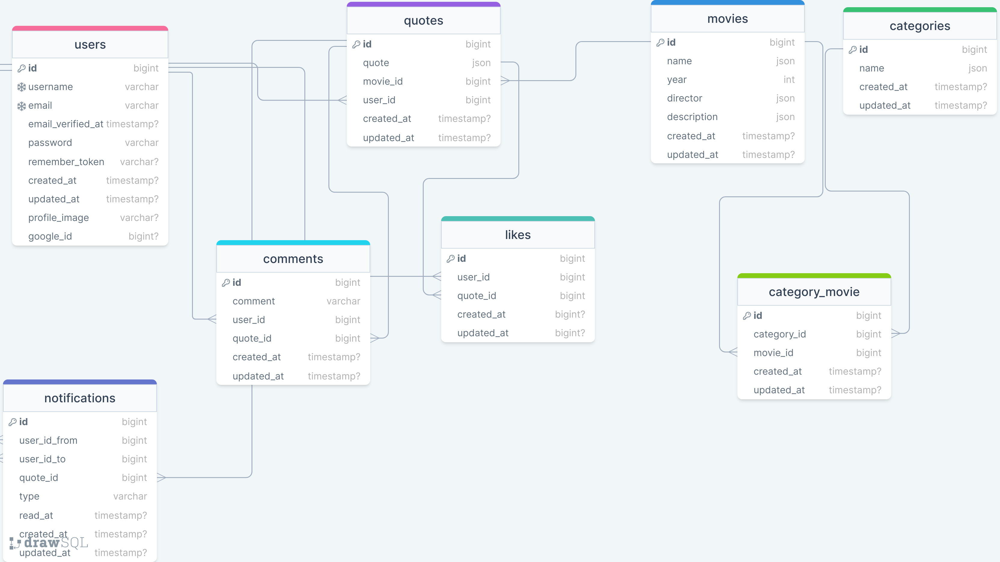

<h1>MovieQuotes Application - Backend</h1>

---

Welcome to the MovieQuotes API! This API serves as the backend for providing functionalities related to movies and quotes. It handles user authentication, movie and quote creation, interactions such as likes and comments, notifications, and various other features to enhance the user experience.

## Overview

The backend of the MovieQuotes application serves as the central logic handler, facilitating communication between the frontend and the database. It manages user interactions, movie and quote functionalities, and data retrieval to ensure a smooth and efficient experience for users. Built using Laravel and MySQL, it effectively handles user authorizations, data management, and real-time updates using Laravel Echo and Pusher.

### Technologies Used

-   **Laravel**: PHP framework for web and API development, providing tools for routing, authentication, database management, and more.
-   **MySQL**: Relational database management system used for storing and managing data in Laravel applications.
-   **Laravel Sanctum**: SPA-based authentication package for securing API endpoints and authenticating users in Laravel applications.
-   **Laravel Socialite**: For handling OAuth authentication with Google.
-   **Laravel Echo**: A JavaScript library that makes it easy to work with WebSockets in Laravel.
-   **Pusher**: A hosted service that makes it easy to add real-time data and functionality to web and mobile applications.
-   **Laravel Queue**: For handling queued operations.
-   **Spatie Media Library**: For managing images and other media.
-   **Spatie Query Builder**: For filtering and sorting queries.
-   **Spatie Translatable**: For managing multi-language support.

### Prerequisites

-   PHP version 8.2 or higher.
-   MySQL version 8.0 or higher.
-   Composer for managing PHP dependencies.
-   Laravel 11.

### Getting Started

1. Clone the MovieQuotes API repository from GitHub.

```sh
git clone https://github.com/RedberryInternship/back-movie-quotes-omar-jangavadze
```

2\. Next step requires you to run _composer install_ in order to install all the dependencies.

```sh
composer install
```

3\. Now we need to set our env file. Go to the root of your project and execute this command.

```sh
cp .env.example .env
```

And now you should provide **.env** file all the necessary environment variables:

#

**Google Auth:**

> GOOGLE_CLIENT_ID=your_google_client_id

> GOOGLE_CLIENT_SECRET=your_google_client_secret

#

**Laravel Sanctum:**

> FRONTEND_URL=http://localhost:5173
> SESSION_DOMAIN=localhost
> SANCTUM_STATEFUL_DOMAINS=localhost:5173

#

**Pusher:**

> PUSHER_APP_ID=your_pusher_id
> PUSHER_APP_KEY=your_pusher_key
> PUSHER_APP_SECRET=your_pusher_secret
> PUSHER_HOST=
> PUSHER_PORT=443
> PUSHER_SCHEME="https"
> PUSHER_APP_CLUSTER=your_pusher_secret

> BROADCAST_CONNECTION=pusher

#

**Mail:**

> MAIL_MAILER=smtp
> MAIL_HOST=your_smtp_server_address
> MAIL_PORT=your_smtp_server_port
> MAIL_USERNAME=your_server_username
> MAIL_PASSWORD=your_server_password
> MAIL_ENCRYPTION=tls
> MAIL_FROM_ADDRESS=your_desired_address
> MAIL_FROM_NAME="${APP_NAME}"

#

**MYSQL:**

> DB_CONNECTION=mysql

> DB_HOST=127.0.0.1

> DB_PORT=3306

> DB_DATABASE=**\***

> DB_USERNAME=**\***

> DB_PASSWORD=**\***

#

4\. Clear the environment variables

```sh
php artisan optimize:clear
```

#

## Migration

if you've completed getting started section, then migrating database is fairly simple process, just execute:

```sh
php artisan migrate
```

#

## Queue

Since some of the events and notifications are used with Laravel queue, in order to make these events work, execute:

```sh
php artisan queue:work
```

#

## Seed movie categories

```sh
php artisan db:seed --class=CategorySeeder
```

#

### Development

You can run Laravel's built-in development server by executing:

```sh
  php artisan serve
```

#

### API endpoints

1.  **User Endpoints**

    -   **GET** `/user`
    -   Controller: `UserController@update`
    -   Description: Retrieves information about the authenticated user.
    -   Middleware: `auth:sanctum`

    -   **PATCH** `/update-profile`
    -   Controller: `UserController@update`
    -   Description: Retrieves and updates authenticated user's profile information.
    -   Middleware: auth:sanctum

2.  **Movie Endpoints**

    -   **GET** `/get-movies`
    -   Controller: `MovieController@index`
    -   Description: Retrieves a personalized list of movies to the user.
    -   Parameters: None

    -   **GET** `/movies/{movie}`
    -   Controller: `MovieController@show`
    -   Description: Retrieves details of a specific movie.
    -   Parameters: `{movie}` (movie ID)

    -   **POST** `/add/movie`
    -   Controller: `MovieController@store`
    -   Description: Adds a new movie.
    -   Parameters: Movie data in the request body

    -   **PATCH** `/edit/movie{movie}`
    -   Controller: `MovieController@update`
    -   Description: Updates a specific movie.
    -   Parameters: `{movie}` (movie ID), Movie data in the request body

    -   **DELETE** `/delete-movie/{movie}`
    -   Controller: `MovieController@destroy`
    -   Description: Deletes a specific movie.
    -   Parameters: `{movie}` (movie ID)

3.  **Quote Endpoints**

    -   **GET** `/get-quotes`
    -   Controller: `QuoteController@index`
    -   Description: Retrieves a list of quotes.
    -   Parameters: None

    -   **GET** `/get-quote/{quote}`
    -   Controller: `QuoteController@show`
    -   Description: Retrieves details of a specific quote.
    -   Parameters: `{quote}` (quote ID)

    -   **POST** `/add/quote`
    -   Controller: `QuoteController@store`
    -   Description: Adds a new quote.
    -   Parameters: Quote data in the request body

    -   **PATCH** `/edit/quote{quote}`
    -   Controller: `QuoteController@update`
    -   Description: Updates a specific quote.
    -   Parameters: `{quote}` (quote ID), Quote data in the request body

    -   **DELETE** `/delete-quote/{quote}`
    -   Controller: `QuoteController@destroy`
    -   Description: Deletes a specific quote.
    -   Parameters: `{quote}` (quote ID)

    -   **POST** `/update/like/{quote}`
    -   Controller: `QuoteController@updateLike`
    -   Description: Updates the like status of a specific quote.
    -   Parameters: `{quote}` (quote ID)

    -   **POST** `/add-comment/{quote}`
    -   Controller: `QuoteController@addComment`
    -   Description: Adds a comment to a specific quote.
    -   Parameters: `{quote}` (quote ID), Comment data in the request body

4.  **Notification Endpoints**

    -   **GET** `/notifications`
    -   Controller: `NotificationController@index`
    -   Description: Retrieves a list of notifications for the relevant user.
    -   Parameters: None

    -   **POST** `/notifications/mark-as-read/{notification}`
    -   Controller: `NotificationController@markNotification`
    -   Description: Marks a specific notification as read.
    -   Parameters: `{notification}` (notification ID)

    -   **POST** `/notifications/mark-all`
    -   Controller: `NotificationController@markAllAsRead`
    -   Description: Marks all notifications as read.
    -   Parameters: None

5.  **Retrieve Categories**

    -   **GET** `/categories`
    -   Controller: CategoryController@index
    -   Description: Retrieves a list of categories.
    -   Parameters: None

6.  **Authentication Endpoints**

    -   **POST** `/signup`
    -   Controller: `AuthController@signup`
    -   Description: Registers a new user.
    -   Middleware: `guest`

    -   **POST** `/login`
    -   Controller: `AuthController@login`
    -   Description: Logs in a user.
    -   Middleware: `guest`

    -   **POST** `/logout`
    -   Controller: `AuthController@logout`
    -   Description: Logs out the authenticated user.
    -   Middleware: `auth:sanctum`

    -   **POST** `/forgot-password`
    -   Controller: `AuthController@forgotPassword`
    -   Description: Initiates the password reset process.
    -   Middleware: `guest`

    -   **POST** `/reset-password`
    -   Controller: `AuthController@resetPassword`
    -   Description: Resets the user's password.
    -   Middleware: `guest`

7.  **Email Verification Endpoints**

    -   **GET** `/email/verify/{id}/{hash}`

    -   **POST** `/email/verify/{id}/{hash}`
    -   Controller: `VerificationController`
    -   Description: Handles email verification.
    -   Middleware: `signed, throttle:6,1`

8.  **Google Authentication Endpoints**

    -   **GET** `auth/google/redirect`

    -   **GET** `auth/google/callback`
    -   Controller: `GoogleAuthController`
    -   Description: Handles Google OAuth authentication.
    -   Middleware: `guest`

#

### Project Structure

```bash
├─── app/
├── Events
│   ├── QuoteCommented
│   ├── QuoteCommentNotificaiton
│   ├── QuoteLiked
│   ├── QuoteLikeNotification
├── Http
│   ├── Controllers
├── ├── ├── AuthController
├── ├── ├── CategoryController
├── ├── ├── Controller
├── ├── ├── GoogleAuthController
├── ├── ├── MovieController
├── ├── ├── NotificationController
├── ├── ├── QuoteController
├── ├── ├── UserController
├── ├── ├── VerificationController
│   └── Middleware
├── ├── ├── Localization
├── ├── ├── RestrictAuthorizedUsers
│   └── Requests
├── ├── ├── StoreForgitPassword
├── ├── ├── StoreLoginRequest
├── ├── ├── StoreMovieRequest
├── ├── ├── StoreMovieUpdateRequest
├── ├── ├── StoreQuoteRequest
├── ├── ├── StoreQuoteUpdateRequest
├── ├── ├── StoreResetPasswordRequest
├── ├── ├── StoreSignupRequest
├── ├── ├── StoreUpdateProfileRequest
│   └── Resources
├── ├── ├── CommentResource
├── ├── ├── MovieIndexResource
├── ├── ├── MovieShowResource
├── ├── ├── QuoteMovieResource
├── ├── ├── QuoteResource
├── ├── ├── UserResource
├── Models
│   ├── Category
│   ├── Comment
│   ├── Like
│   ├── Movie
│   ├── Notification
│   ├── Quote
│   ├── User
├── Notifications
│   ├── ResetPasswordNotification
│   ├── VerifiyemailNotification
├── Providers
│   ├── AppServiceProvider
bootstrap/
config/
database/
lang/
public/
resources/
routes/
storage/
tests/
vendor/
.env
artisan
composer.json
vite.config.js
```

### FRONTEND

<a href="https://github.com/RedberryInternship/front-movie-quotes-omar-jangavadze">MovieQuotes Frontend</a>

### Interaction


